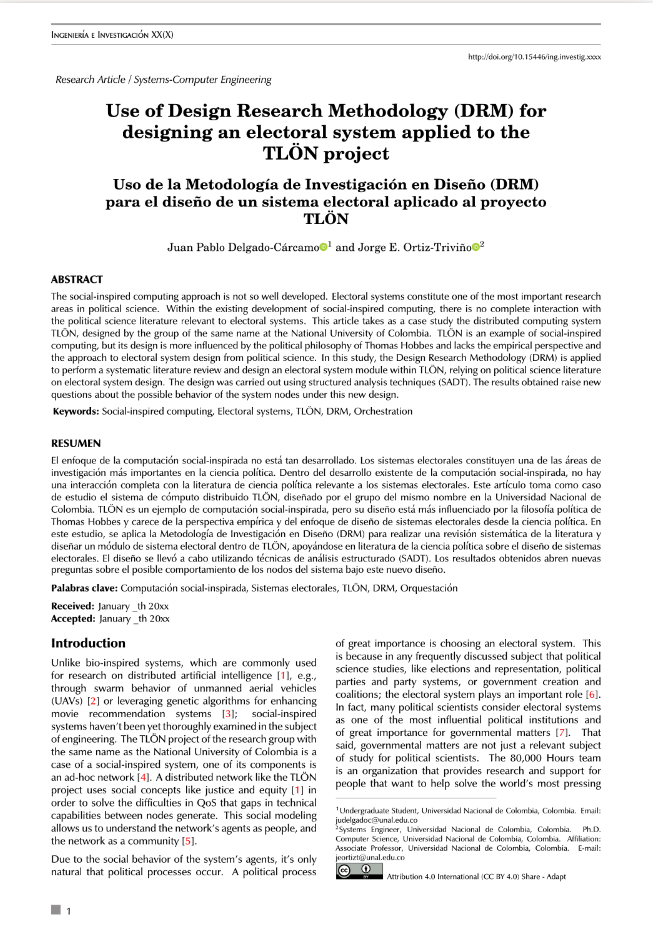
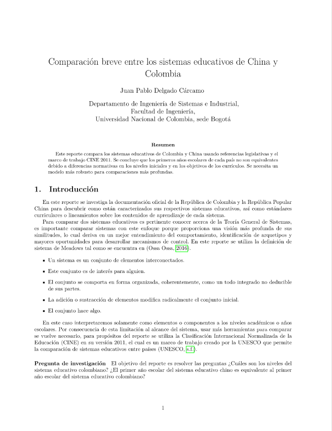

# Research

According to Booth [1], doing research is when we try to gather information to answer a question, basically to answer and remember something, that's why it's also important to write it up in the form of a paper. I find this very interesting, I've tried to do it in the past for personal discussions. As a result I haven't polished the quality of these works, nonetheless I believe they're a good start.

## Use of Design Research Methodology (DRM) for designing an electoral system applied to the TLÖN project (2025)

For the final project of my undergraduate's I wrote a research paper, it needs polishing.

(Click the image to see the PDF)

## Comparison of education systems (2023)

One time I wanted to win a discussion with a very stubborn friend, I tried to write a small report to support my arguments, this document is the result. It's not very formal, but I wanted to have a discussion in a scientific way. 

(Click the image to see the PDF)

# Projects

For projects posted in Github Pages

## ErrorGerm

I loved doing [this](/errorgerm) website

当上大学的第二学期的时候，我觉得非常害怕，因为我的来历不太好。童年我没有机会学物理，然后各位教授老说“这个方面你们应该知道了，你们在高中一定学习了”但是对我来说，这个不是这样。

我努力学习，结果我喜爱实验室上课。格外喜欢Error propagation。那时间我使用Python为了算Error propagation。学期结束了想要编程一种更详细程序。这个小网站是那个结果。

# References

  

    
[1]

Wayne C. Booth. 2016. <i>The Craft of Research</i> (4th ed ed.). University of Chicago Press, Chicago.

  

